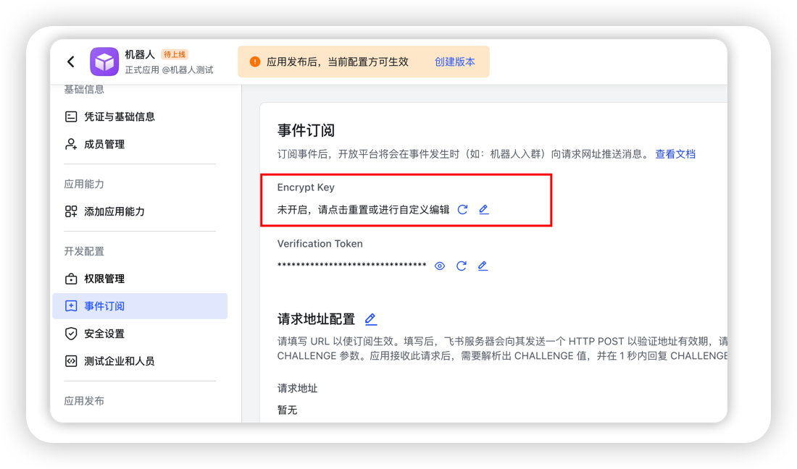
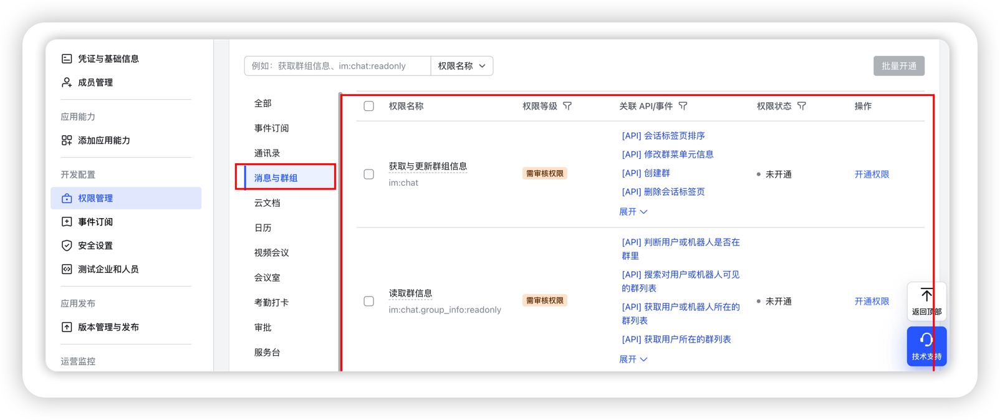
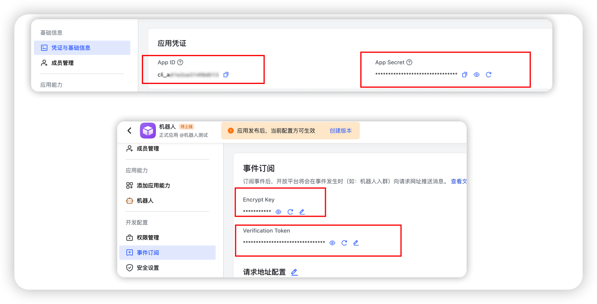
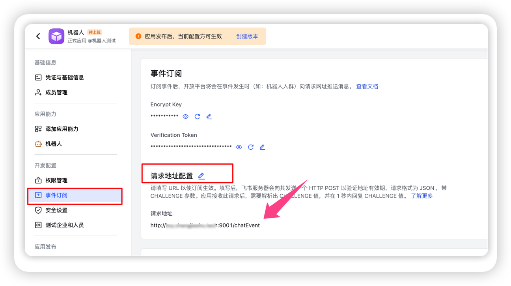
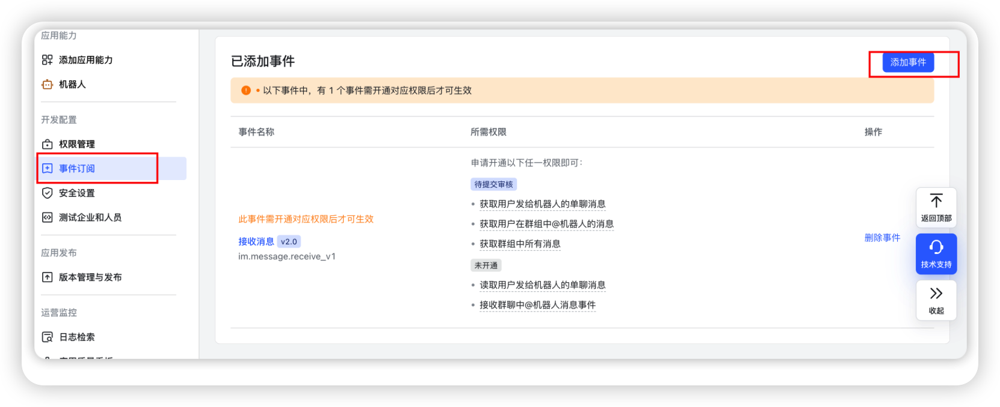
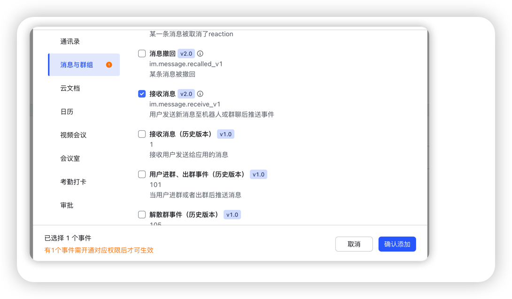
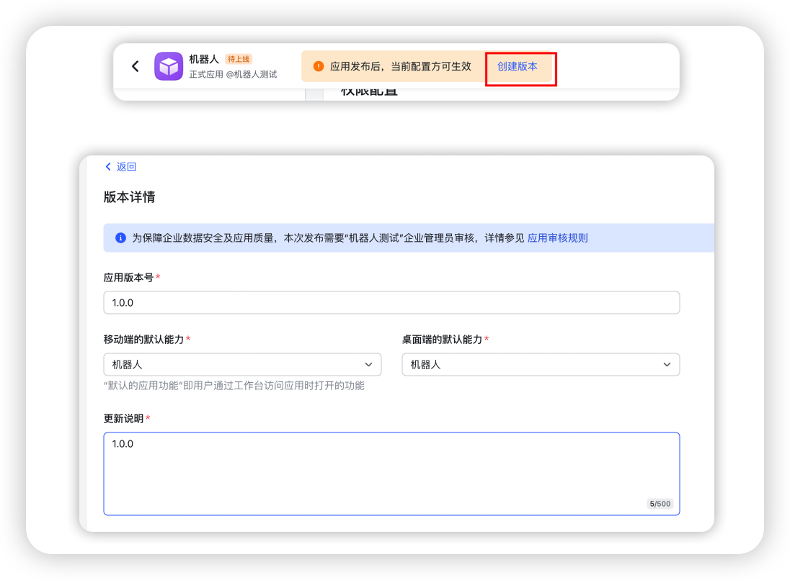
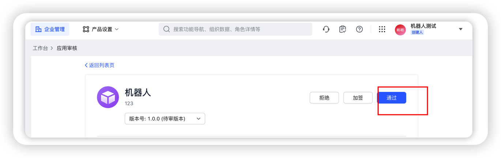
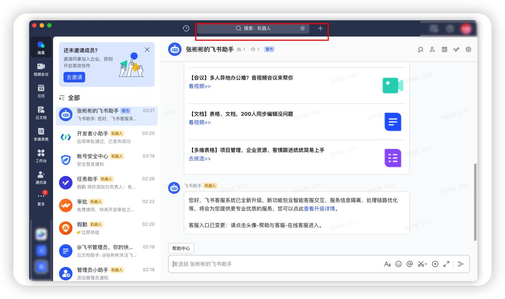

1. 浏览器登录[飞书](https://aiw8qncwo9a.feishu.cn/accounts/page/login?redirect_uri=https%3A%2F%2Faiw8qncwo9a.feishu.cn%2Fadmin%2Findex&app_id=13)
2. 创建新企业账号(个人用户无法使用应用机器人) 


3. [创建应用](https://open.feishu.cn/app?lang=zh-CN)

​		配置应用能力


​	配置Encrypt Kgitey，自定义个密码输进去就ok了，后面配置文件要用



所有的权限都开通



填写accounts-sample.yaml文件

填写application-sample.yaml配置文件




配置文件的代理可选择默认用我的代理，或者自建 [教程](https://github.com/linweiyuan/go-chatgpt-api)

启动项目，项目根目录下运行

```shell
chmod +x start-docker.sh
sudo ./start-docker.sh

#查看日志
sudo docker logs -f feishubot
```

保证服务器防火墙端口9001打开

浏览器打开输入http://ip:9001/ping，如果响应pong则9001端口打开了


配置事件订阅地址



配置卡片事件地址






发布应用




申请线上发布

审核https://pw6tyxlat7m.feishu.cn/admin/appCenter/audit/



搜索你的应用名称



私聊即可使用


更新项目重新运行start-docker.sh即可