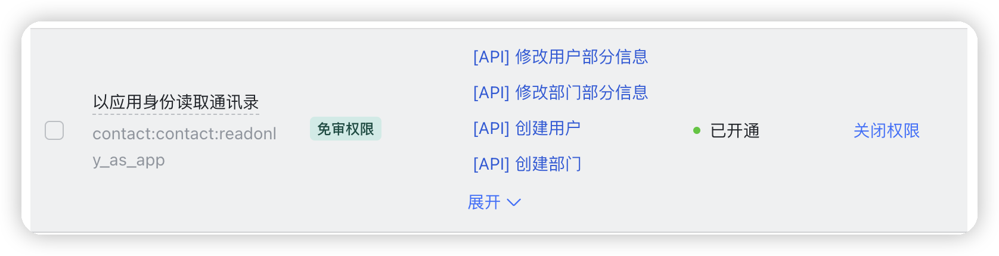
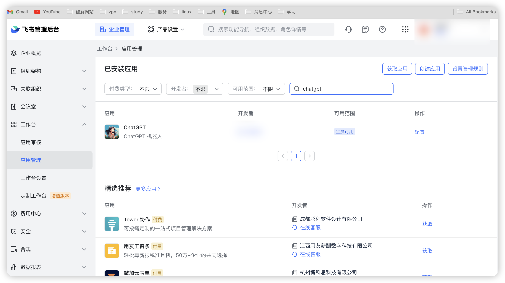
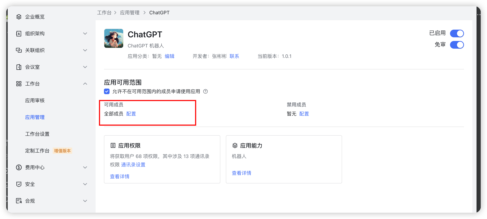
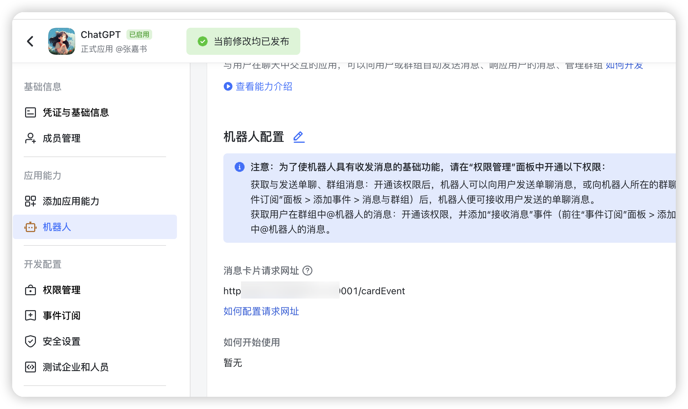
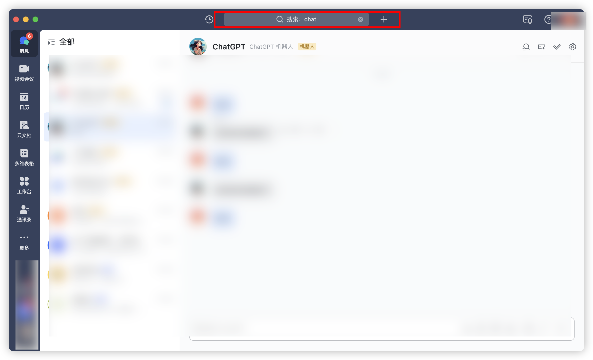

1. 浏览器登录[飞书](https://aiw8qncwo9a.feishu.cn/accounts/page/login?redirect_uri=https%3A%2F%2Faiw8qncwo9a.feishu.cn%2Fadmin%2Findex&app_id=13)

2. 创建新企业账号(个人用户无法使用应用机器人)


3. [创建应用](https://open.feishu.cn/app?lang=zh-CN)

 配置应用能力


 配置Encrypt Key，自定义个密码或者随机输进去就ok了，后面配置文件需要填


将通讯录下以应用身份权限开通



同时还需要登录到飞书管理后台(浏览器搜索飞书管理后台，一般第一个点进去就跟我差不多的界面)，找到你的应用



将可用成员配置成全部成员，否则会报获取用户列表失败错误。需要读取用户列表权限的作用是添加账号时配置账号对哪些用户开放需要以及统计每个用户的使用情况时需要使用。



开通消息与群组列表下的权限，开通第一页内所有的即可。作用是应用可以发消息（如果程序启动，日志上并未打印你与机器人发送的私聊消息则检查此处的权限和后续事件订阅里的权限）


填写application-sample.yaml配置文件，其中 redis 相关的如果用 docker 方式启动可以保持默认

```shell
my-config:
  app-id:    #见下图   
  app-secret:  #见下图
  encrypt-key:  #见下图
  verification-token:   #见下图
  proxy-url: http://rnproxy.zhangjiashu.tech #已挂，自建或者使用别人的
  user-name: admin   #前端页面的登录账号和密码
  password: admin
```


配置文件的代理可选择自建，相关项目链接： [教程](https://github.com/linweiyuan/go-chatgpt-api)

或者进群找我要代理地址

前端配置.env文件

```shell
VUE_APP_API_BASE_URL=http://ip:9001/    #将 ip 换成服务器的 ip 就行
```


启动项目，项目根目录下运行

```shell
sudo docker-compose up -d

#查看日志
sudo docker-compose logs -f
```

保证服务器防火墙端口9001打开，前端需要放开 9002 端口

浏览器打开输入http://ip:9001/ping     

如果响应pong则9001端口打开了

配置事件订阅地址，地址为 http://ip:9001/chatEvent

如果提示添加失败等错误，检查程序是否成功启动，端口是否开放，飞书填写的 url 是否正确，配置文件中 encryptKey 等参数是否配置正确


添加订阅的事件，见下图。目的是让程序能订阅到你发给机器人的消息事件


添加消息卡片的请求地址

地址为http://ip+9001/cardEvent



发布应用


申请线上发布

审核https://pw6tyxlat7m.feishu.cn/admin/appCenter/audit/


在前端项目的账号管理页面添加账号即可

搜索你的应用名称，私聊即可使用



如果觉得部署太麻烦，也可以进群私聊群主申请加入企业，直接使用我部署好的机器人。

